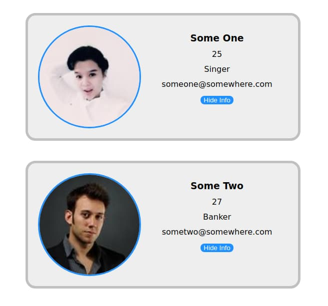

<div align = "center">

<h1><a href="https://2kabhishek.github.io/user-card-wc">user-card-wc</a></h1>

<a href="https://github.com/2KAbhishek/user-card-wc/blob/master/LICENSE">
 </a>

<a href="https://github.com/2KAbhishek/user-card-wc/pulse">
 </a>

<a href="https://github.com/2KAbhishek/user-card-wc/stargazers">
</a>

<a href="https://github.com/2KAbhishek/user-card-wc/network/members">
 </a>

<a href="https://github.com/2KAbhishek/user-card-wc/watchers">
 </a>

<a href="https://github.com/2KAbhishek/user-card-wc/graphs/contributors">
 </a>

<a href="https://github.com/2KAbhishek?tab=followers">
 </a>

<h3>Reusable user profile component 👧🏻👦🏻</h3>

<figure>
  
  <br/>
  <figcaption>user-card-wc Screenshot</figcaption>
</figure>

</div>

## What is it

user-card-wc is a clean and robust user profile card, that can be used in any frontend app.

## Inspiration

Heard about WebComponents and wanted to explore it.

## Prerequisites

Before you begin, ensure you have met the following requirements:

- You have installed the latest version of `a web browser`

## Installing user-card-wc

To install user-card-wc, follow these steps:

```bash
git clone https://github.com/2kabhishek/user-card-wc
cd user-card-wc
```

## How it was built

user-card-wc was built using `web components`

## What I learned

- Learned about the basics of `WebComponents` and what problems they can solve.

## What's next

Build more components or a site maybe

Hit the :star: button if you found this useful.

## More Info

<div align="center">

<a href="https://github.com/2KAbhishek/user-card-wc">Source</a> |
<a href="https://2kabhishek.github.io/user-card-wc">Website</a>

</div>
